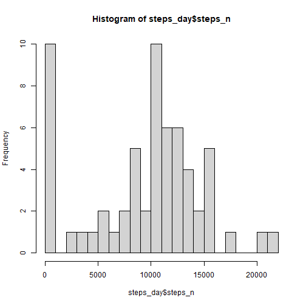
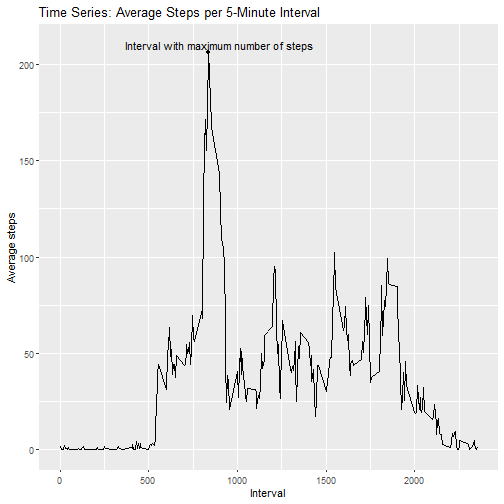
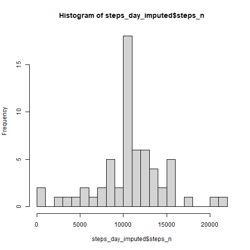
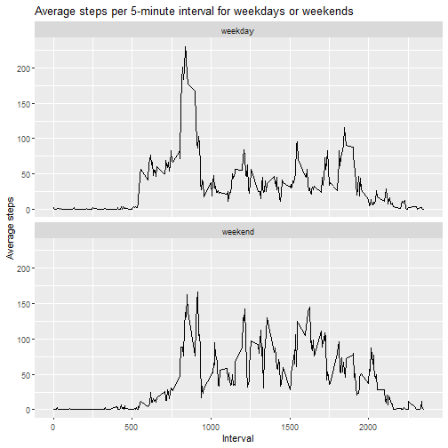

---
---
---

# Reproducible Research Project 1

## Paige Fairchild

1.  **Loading and pre-processing the data**


```r
pacman::p_load(
      tidyverse,
      tidyr
)
data <- read.csv("C:/Users/pfairchild/Downloads/repdata_data_activity/activity.csv")

steps_day <- data %>% 
      group_by(date) %>% 
      summarise(steps_n = sum(steps, na.rm =TRUE))

avg_steps_interval <- data %>% 
      group_by(interval) %>% 
      summarise(steps_2 = mean(steps, na.rm = TRUE))

#identify max interval
max_interval <- avg_steps_interval %>% 
      arrange(-steps_2)

max_interval_x <- max_interval$interval[[1]]
max_interval_y <- round(max_interval$steps_2[[1]], 0)


#counting rows with NAs 
na_rows <- sum(is.na(data))
```

2.  **What is the mean total number of steps taken per day?**


```r
# Histogram of total number of steps taken per day
hist_steps <- hist(steps_day$steps_n, breaks = 20)
```



```r
#Mean and median total number of steps per day

mean_steps <- round(mean(steps_day$steps_n), 0)
median_steps <- median(steps_day$steps_n)
```

The **mean** number of steps taken per day is **9354**.

The **median** number of steps taken per day is **10395**.

3.  **What is the average daily activity pattern?**


```r
#Time series plot 
ggplot(avg_steps_interval, aes(x = interval, y = steps_2))+
      geom_line()+
      xlab("Interval")+
      ylab("Average steps")+
      ggtitle("Time Series: Average Steps per 5-Minute Interval")+
      annotate(geom = "point", x = max_interval_x, y = max_interval_y)+
      annotate("text", x = 900, y = 210, label = "Interval with maximum number of steps")
```



The 5-minute interval, on average across all days in the data set, with the maximum amount of steps is **835**

4.  **Imputing missing values**

The total number of rows with missing values in the dataset is **2304**.


```r
#imputing data

data_imputed <- data %>%
      group_by(interval) %>% 
      mutate(steps = ifelse(is.na(steps), mean(steps, na.rm = TRUE), steps))
```


```r
steps_day_imputed <- data_imputed %>% 
      group_by(date) %>% 
      summarise(steps_n = sum(steps))

hist_steps_imp <- hist(steps_day_imputed$steps_n, breaks = 20)
```



```r
mean_steps_imp <- mean(steps_day_imputed$steps_n)
median_steps_imp <- median(steps_day_imputed$steps_n)
```

In the new dataset, the **mean** number of steps taken per day is **1.0766189 &times; 10<sup>4</sup>**.

In the new dataset, the **median** number of steps taken per day is **1.0766189 &times; 10<sup>4</sup>**.

After imputation, the mean and median number of steps per day are equal.

5.  **Are there differences in activity patterns between weekdays and weekends?**


```r
data_imputed$date <- as.Date(data_imputed$date)
day <- ifelse(weekdays(data_imputed$date) %in% c("Saturday", "Sunday"), "weekend", "weekday")
data_imputed$day <- as.factor(day)
```


```r
steps_weekday <- aggregate(steps~interval + day, data = data_imputed, mean)
ggplot(steps_weekday, aes(interval, steps))+
      geom_line() +
      facet_wrap(.~day, nrow = 2, ncol = 1)+
      labs(title = "Average steps per 5-minute interval for weekdays or weekends", x = "Interval", y = "Average steps")
```


